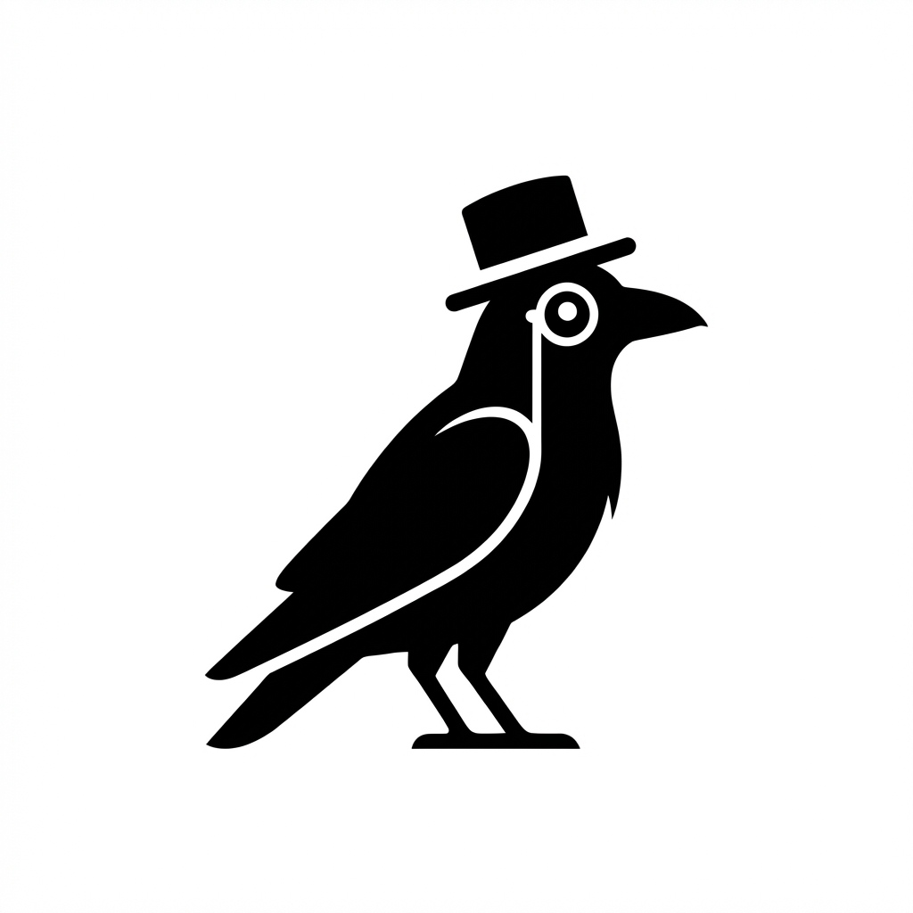

# Lumis



### Your AI confidant. Lumis helps you capture the small moments from your day, synthesize research into lessons, and turn your real life into content worth sharing.

Tell Lumis about your life, share research you are interested in, and learn to craft your own stories.

#### Lumis will help you find the connections across what you've lived and what you've learned:

- **Define your voice** `/init` walks you through setting up your vault, voice, and personalized content toolkit
- **Captures moments** and identifies the "5-second moment," the instant something shifted
- **Finds connections** to your past moments, things you might not have linked on your own
- **Builds a Pattern Map** in Obsidian that visualizes how your moments relate over time
- **Saves research** from articles, books, and videos, and distills them into lessons
- **Captures inspiration** by researching people you admire and connecting them to your vault
- **Challenges your thinking** through targeted critical thinking prompts with honest feedback
- **Develops stories** through free writing and guided questions, then shapes them into clean narratives
- **Directs video production** by turning your story into a shot-by-shot timeline, generating avatar clips, and assembling branded video
- **Builds carousels** from stories into card-by-card LinkedIn carousel plans with copy and image direction
- **Writes articles** from stories into full long-form blog posts ready to publish
- **Generates images** for any director format using Google Imagen, with brand-aware prompts that update source files automatically

This repo is the engine. Your [Obsidian](https://obsidian.md) vault is where your moments, stories, and research live. They stay separate so your personal content never ends up in a code repo. Your stories remain private to you.

## How it works

Lumis owns the full content flywheel. Most tools handle one step. Lumis connects all of them because a video director that doesn't know your moments is useless, and a content tool that doesn't know your voice is just another template.

```
  live your life           read something         someone inspires you
       │                        │                        │
       ▼                        ▼                        ▼
  ┌─────────┐            ┌─────────┐             ┌───────────┐
  │ /moment │            │ /add-   │             │ /add-     │
  │         │            │ research│             │inspiration│
  └────┬────┘            └────┬────┘             └─────┬─────┘
       │                      │                        │
       │  5-second moment     │  learnings extracted   │  bio researched
       │  connections found   │  topics clustered      │  vault back-links
       │  pattern map built   │  TL;DR companion       │  found
       │                      │                        │
       └──────────────────────┼────────────────────────┘
                              │
                      ┌───────▼───────┐
                      │    Vault      │  moments, learnings, stories,
                      │   (Obsidian)  │  voice, inspiration, patterns
                      └───────┬───────┘
                              │
           ┌──────────────────┼──────────────────┐
           │                  │                  │
   ┌───────▼───────┐  ┌──────▼────────┐  ┌──────▼──────────┐
   │ /craft-content│  │ /craft-       │  │ /challenge      │
   │               │  │  storytelling │  │                 │
   │ free write    │  │               │  │ pressure-test   │
   │ find the story│  │ practice      │  │ your ideas      │
   │ shape the arc │  │ & develop     │  │ honest feedback │
   └───────┬───────┘  └───────────────┘  └─────────────────┘
           │
   ┌───────▼──────────────────┐
   │   Director Cuts          │
   │                          │
   │ /director-video          │  shot-by-shot timeline
   │ /director-carousel       │  card-by-card plan
   │ /director-article        │  full blog post
   │ /director-images         │  AI images (Google Imagen)
   └──┬─────┬─────────┬───────┘
      │     │         │
      │     │         └──────────────────────┐
      │     └──────────────┐                 │
      ▼                    ▼                 ▼
   timeline.md        carousel.md      article.md
   (shot-by-shot)     (LinkedIn)       (blog)
      │
      │  lumis studio render <slug>
      ▼
   ┌──────────────┐
   │   Studio     │
   │              │
   │ HeyGen      │  avatar clips
   │ ElevenLabs  │  voiceover audio
   │ Remotion    │  branded render
   └──────┬───────┘
          │
          ▼
    branded .mp4
    (YouTube)
```

Each step feeds the next. Your moments become the raw material for stories. `/craft-content` finds the story through free writing and guided questions. The director skills turn stories into platform-ready formats: `/director-video` creates a shot-by-shot timeline that the Studio renders into branded video (HeyGen avatars, ElevenLabs voiceover, Remotion assembly), `/director-carousel` builds a card-by-card LinkedIn carousel plan, and `/director-article` writes a full long-form blog post. `/director-images` generates AI images for any of these formats using Google Imagen, building brand-aware prompts and updating the source files so images flow into rendering automatically.

## Setup

```bash
git clone https://github.com/allthriveai/lumis.git
cd lumis
npm install
npm run build
claude
/init
```

`/init` walks you through choosing your vault path, scaffolds the directory structure, interviews you to populate Voice.md, then copies and personalizes the Amplify toolkit (8 hook types, 18 content structures, persuasion glossary) using your voice. Lumis reads Voice.md at every layer to align moments, stories, and video with your identity.

## Commands

```
/init               Set up vault, voice, and Amplify toolkit
/voice              Fill in or redo your Voice.md
/moment             Capture a moment
/add-research       Save and categorize research
/add-inspiration    Capture a person who inspires you
/craft-content      Free write, find the story, shape the narrative
/craft-storytelling Practice or develop storytelling from moments
/director-video     Build a shot-by-shot timeline and produce video
/director-carousel  Build a LinkedIn carousel from a story
/director-article   Write a long-form article from a story
/director-images    Generate AI images for any director format
/challenge          Pressure-test an idea with critical thinking prompts
/brand              Set up your visual brand identity

lumis studio list           List all director cuts with status
lumis studio render <slug>  Render a director cut to branded video
lumis studio preview        Open Remotion Studio for previewing
```

## Docs

- **[Vault structure](docs/vault.md)** — how the Obsidian vault is organized, Voice.md, Amplify toolkit
- **[Signals](docs/signals.md)** — event log connecting pipeline stages
- **[Memory](docs/memory.md)** — session history and user preferences
- **[MCP Server](docs/mcp.md)** — all tools and Claude Desktop config
- **[Studio](docs/studio.md)** — video production pipeline, image generation, and API setup

## Tech stack

- **Node.js + TypeScript** with ES modules
- **Claude API** for moment analysis and story development
- **gray-matter** for YAML frontmatter parsing
- **MCP SDK** for Claude Code integration
- **Remotion** for programmatic video rendering
- **HeyGen** for AI avatar video generation
- **ElevenLabs** for text-to-speech
- **Google Imagen** for AI image generation

## License

MIT. See [LICENSE](./LICENSE).
